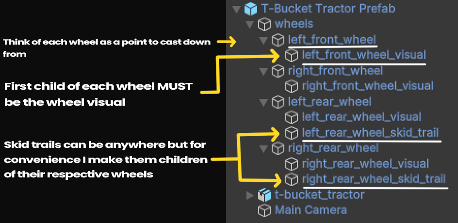
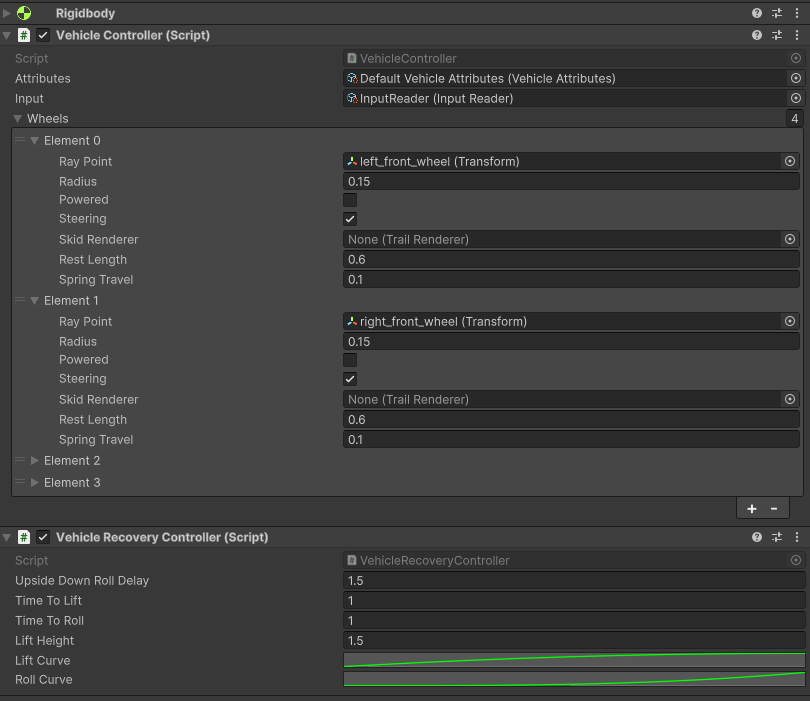
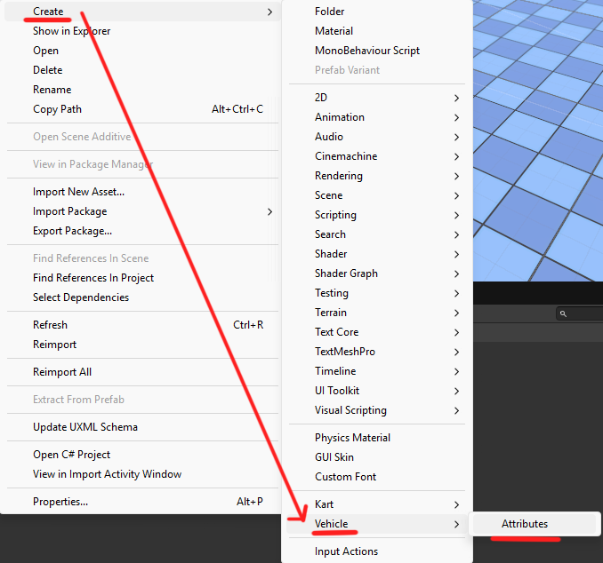
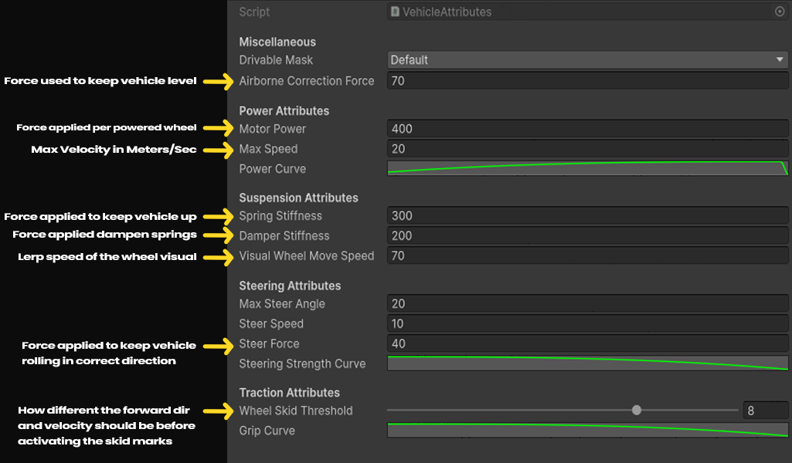
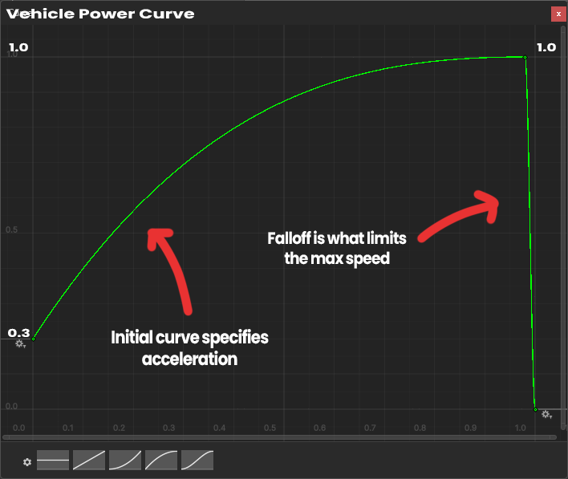
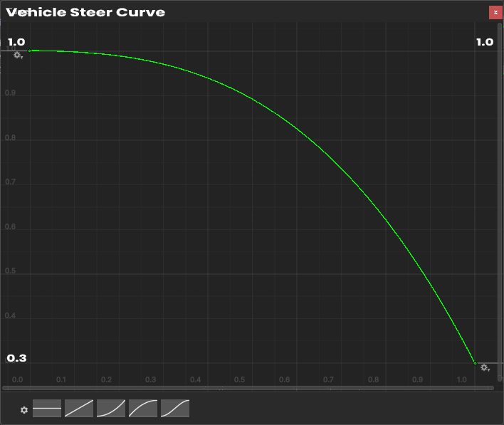
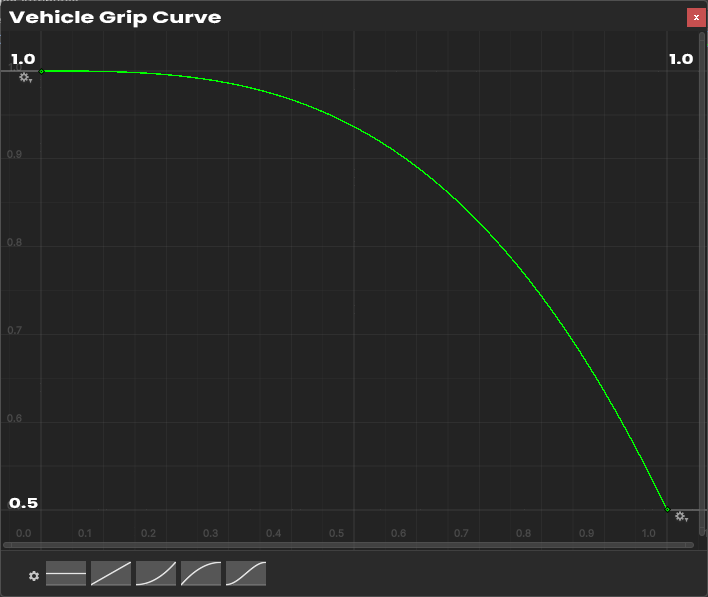

# SimpleVehicles

SimpleVehicles is a lightweight Unity package that provides a basic implementation of arcade-style vehicle physics. It is designed for quick prototyping, easy customization, and smooth arcade driving mechanics.

## Features

- Simple and responsive vehicle controls
- Arcade-style physics for fun and accessible driving
- Easy-to-use components for quick setup
- Adjustable parameters for fine-tuning vehicle behavior

## Installation

1. Copy this Repository's URL
2. Go to Unity
3. At the top, select **Window** -> **Package Manager**
4. In the top left, select the **(+)** Icon
5. Select `Install Package from git URL...`
6. Past the Repository URL
7. Finally, click **Install**.

---

## Vehicle Hierarchy Structure

---

## Vehicle Components Example

---

## Vehicle Attributes Explanation

### How to create custom vehicle attributes?

### What do the attributes mean?

### Power Curve Explanation

### Steering Curve Explanation

### Grip Curve Explanation

---

## Future Updates

- Vehicle sound system: wheel spin, engine sound, etc
- More vehicle prefabs with different handling styles

If you have any feedback or feature requests, feel free to reach out!
